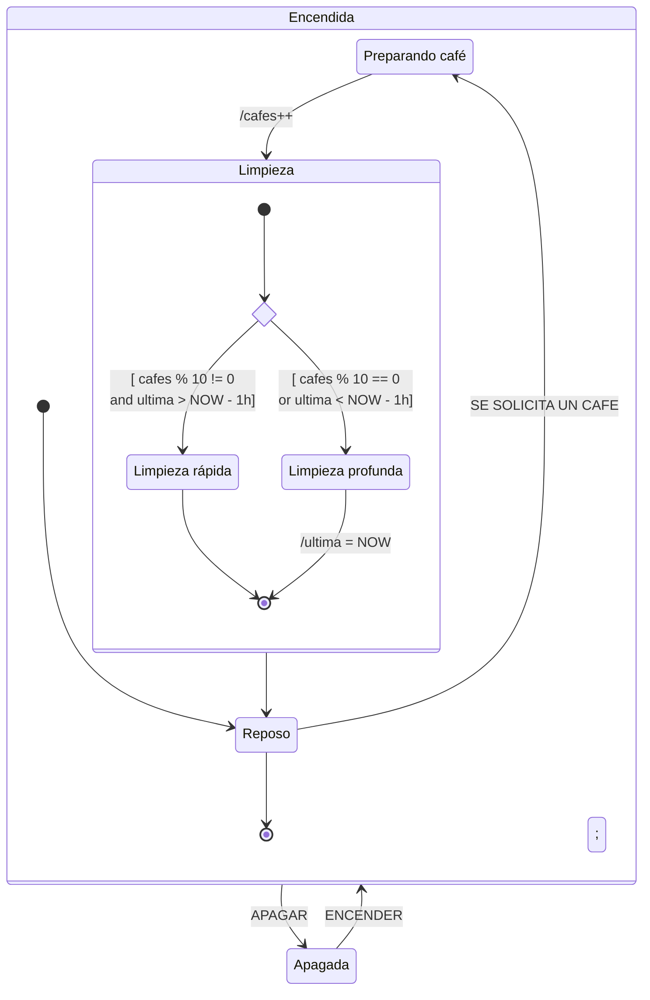
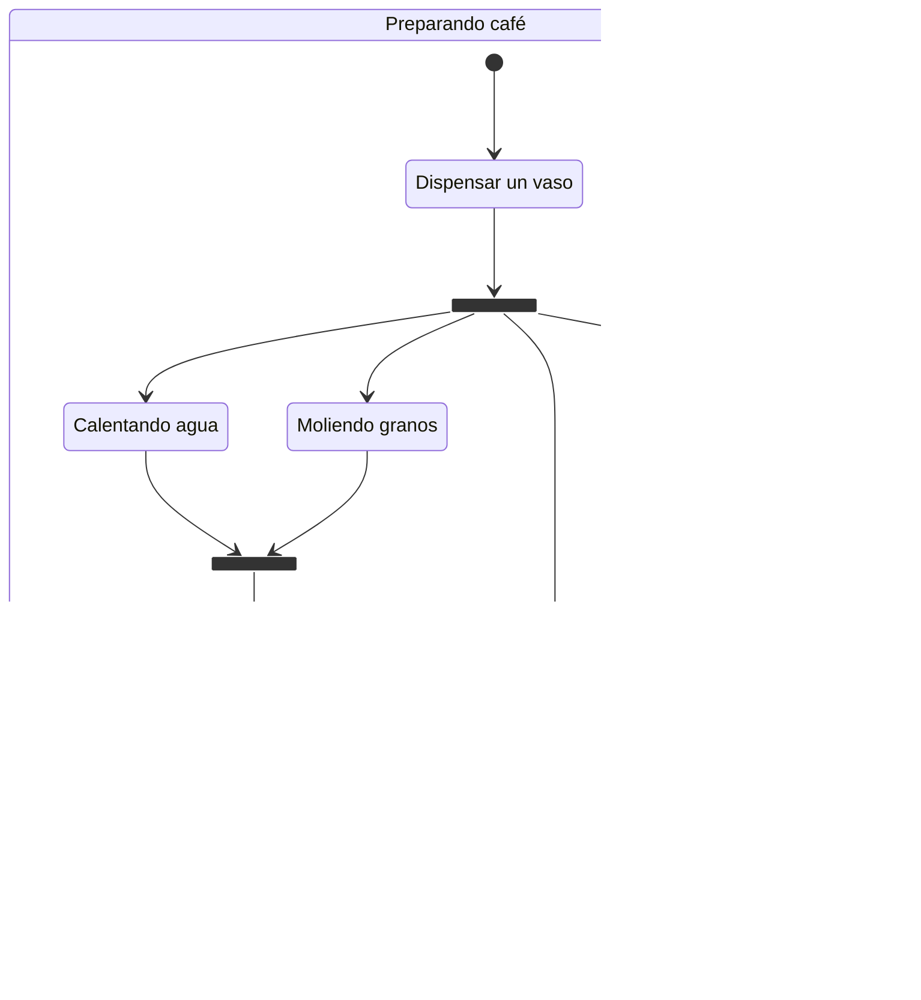
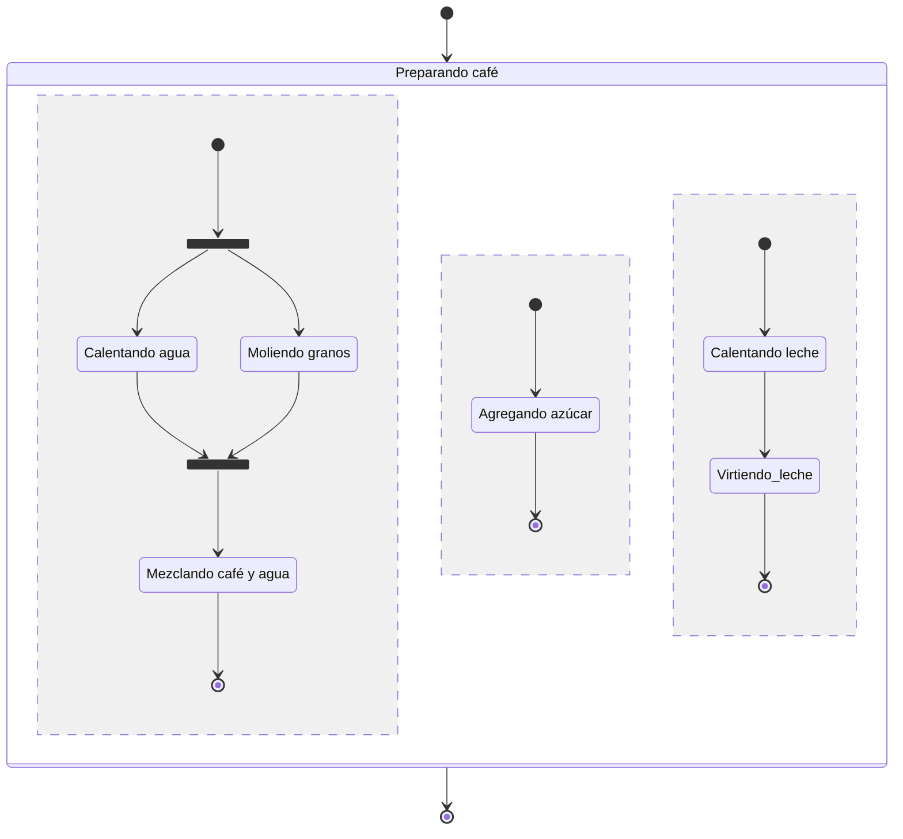

# Máquina expendedora de café (pasillos)

```mermaid

stateDiagram-v2

Preparando: Preparando café
rapida: Limpieza rápida
profunda: Limpieza profunda
state decidir_tipo_limpieza <<choice>>

state Limpieza {
    [*] --> decidir_tipo_limpieza
    decidir_tipo_limpieza --> rapida: [ cafes % 10 != 0 <br/> and ultima > NOW - 1h]
    decidir_tipo_limpieza --> profunda: [ cafes % 10 == 0 <br/> or ultima < NOW - 1h]
    rapida --> [*]
    profunda --> [*]: /ultima = NOW
}

state Encendida {
    [*] --> Reposo
    Reposo --> Preparando: SE SOLICITA UN CAFE
    Preparando --> Limpieza: /cafes++;
    Limpieza --> Reposo
    Reposo --> [*]
}

Apagada --> Encendida: ENCENDER
Encendida --> Apagada: APAGAR


```

**% Es el Operador MODULO o RESTO (MODULE o REMAINDER): Resto de la división entera**

---

# Detalle del estado preparando café

```mermaid

stateDiagram-v2

Preparando: Preparando café
Calentando_agua: Calentando agua
Calentando_leche: Calentando leche
Moliendo_granos: Moliendo granos
cafe: Mezclando café y agua
azucar: Agregando azúcar
vaso: Dispensar un vaso

state comienzo_en_paralelo <<fork>>
state fin_paralelo <<join>>
state fin_proceso_cafe <<join>>


state Preparando{
    [*] --> vaso
    vaso --> comienzo_en_paralelo
    comienzo_en_paralelo --> Calentando_agua
    comienzo_en_paralelo --> Calentando_leche
    comienzo_en_paralelo --> Moliendo_granos
    comienzo_en_paralelo --> azucar
    Calentando_agua --> fin_proceso_cafe
    Moliendo_granos --> fin_proceso_cafe
    fin_proceso_cafe --> cafe
    cafe --> fin_paralelo
    azucar --> fin_paralelo
    Calentando_leche --> Virtiendo_leche
    Virtiendo_leche --> fin_paralelo
    fin_paralelo --> [*]
}


```

---

```mermaid

stateDiagram-v2

Preparando: Preparando café
Calentando_agua: Calentando agua
Calentando_leche: Calentando leche
Moliendo_granos: Moliendo granos
cafe: Mezclando café y agua
azucar: Agregando azúcar
state comienzo_en_paralelo <<fork>>
state fin_proceso_cafe <<join>>

[*] --> Preparando

state Preparando{
    [*] --> comienzo_en_paralelo
    comienzo_en_paralelo --> Calentando_agua
    comienzo_en_paralelo --> Moliendo_granos
    Calentando_agua --> fin_proceso_cafe
    Moliendo_granos --> fin_proceso_cafe
    fin_proceso_cafe --> cafe
    cafe --> [*]
    --
    [*] --> azucar
    azucar --> [*]
    --
    [*] --> Calentando_leche
    Calentando_leche --> Virtiendo_leche
    Virtiendo_leche --> [*]
}

Preparando --> [*]

```