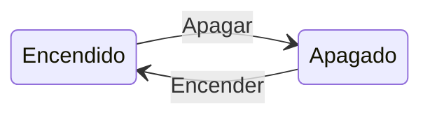
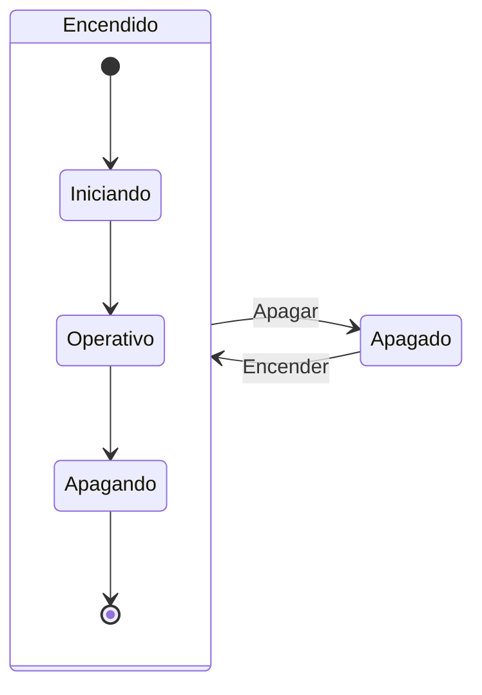
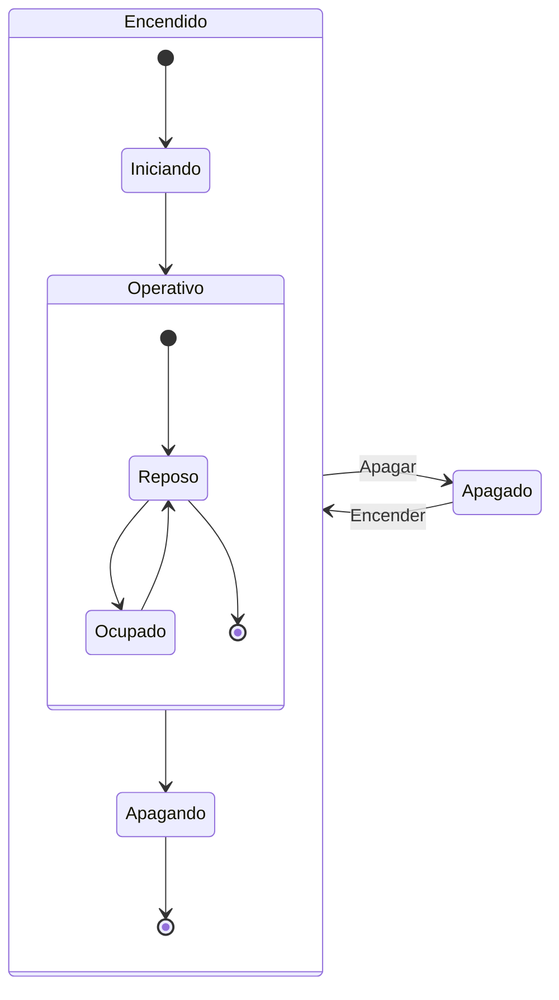
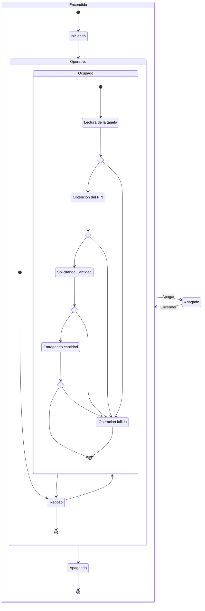
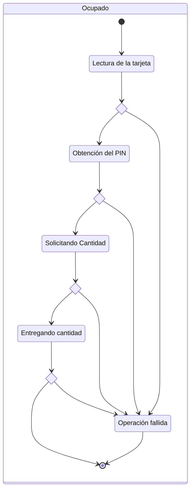

# Diagrama de estados: CAJERO (Operativa de sacar dinero)

ESTADOS: 
    - Apagado
    - Encendido
        - Iniciando
        - Operativo
           - Reposo
           - Lectura de la tarjeta
           - Obtención del PIN
           - Solicitando Cantidad
           - Entregando cantidad
           - Operación fallida
        - Apagando

Sustantivos / Gerundios / Participios (algo que implique un ESTADO: Duración en el tiempo)
Las acciones son de corta duración: ALGO QUE EJECUTO Y TERMINO
Un estado es algo que dura en el tiempo: ALGO QUE ESTOY HACIENDO

TRANSICIONES POSIBLES:
Esa transiciones serían verbos

Apagado -> Encendido: Encender

Encendido -> Apagado: Apagar

---

---

---

---

---

