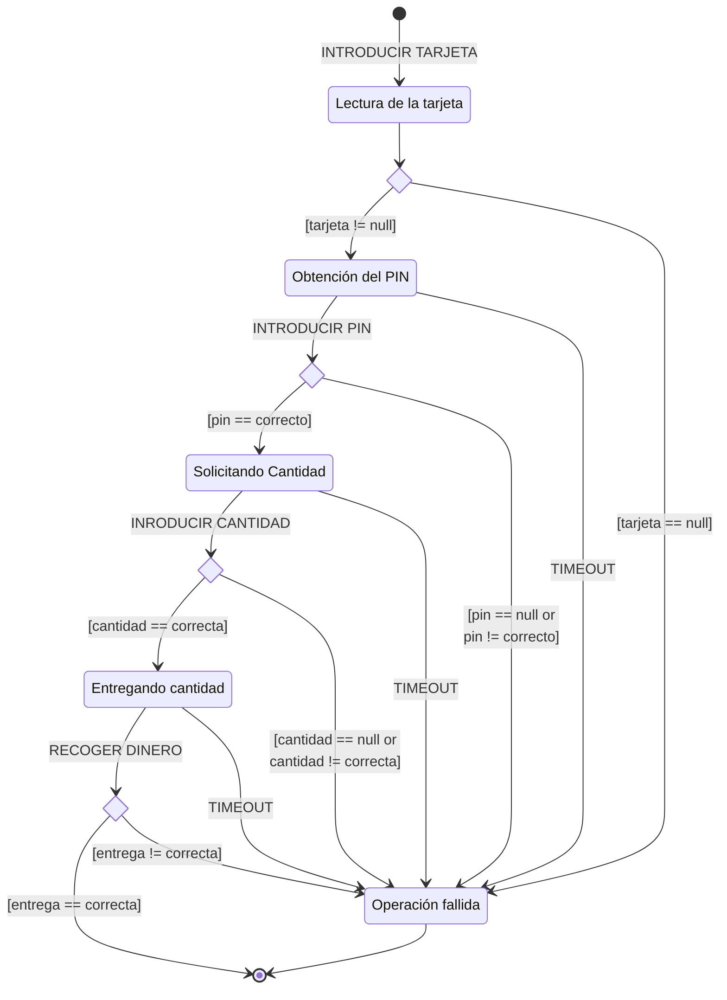

# Diagrama de estados: CAJERO (Operativa de sacar dinero)

```mermaid
stateDiagram-v2
direction TB


Lectura: Lectura de la tarjeta
Pin: Obtención del PIN
Cantidad: Solicitando Cantidad
Entrega: Entregando cantidad
Fallo: Operación fallida

state validar_tarjeta <<choice>>
state leer_tarjeta <<choice>>
state validar_cantidad <<choice>>
state entregar_dinero <<choice>>

    [*] --> Lectura: INTRODUCIR TARJETA
    Lectura --> leer_tarjeta
    leer_tarjeta --> Pin: [tarjeta != null]
    Pin --> validar_tarjeta: INTRODUCIR PIN
    Pin --> Fallo: TIMEOUT
    validar_tarjeta --> Cantidad: [pin == correcto]
    Cantidad --> validar_cantidad: INRODUCIR CANTIDAD
    Cantidad --> Fallo: TIMEOUT
    validar_cantidad --> Entrega: [cantidad == correcta]
    Entrega --> entregar_dinero: RECOGER DINERO
    Entrega --> Fallo: TIMEOUT
    leer_tarjeta --> Fallo: [tarjeta == null]
    validar_tarjeta --> Fallo: [pin == null or<br/> pin != correcto]
    validar_cantidad --> Fallo : [cantidad == null or<br/> cantidad != correcta]
    entregar_dinero --> [*]: [entrega == correcta]
    entregar_dinero --> Fallo: [entrega != correcta]
    Fallo --> [*]


```