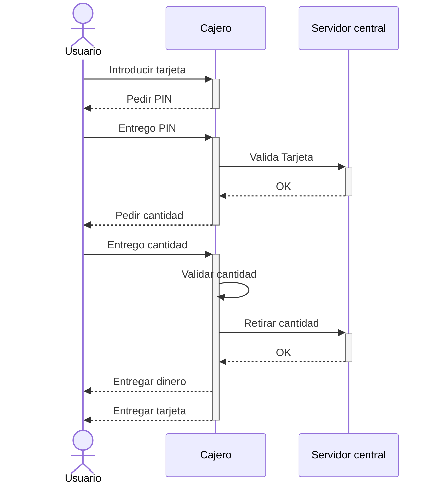
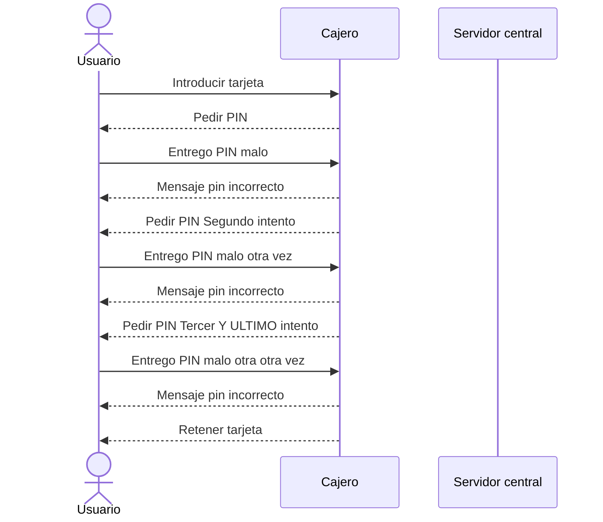
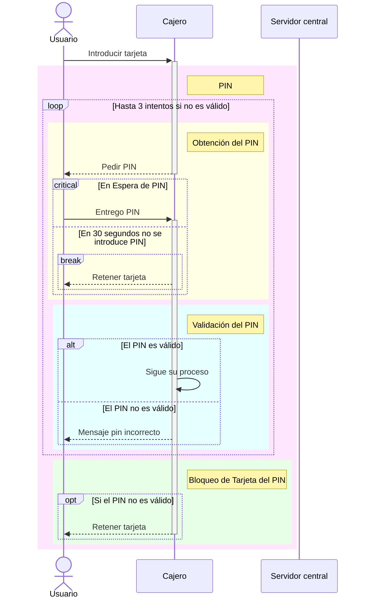

# Diagrama Secuencia: sacar dinero de un cajero

Dar un overview (CAMINO FELIZ) para que la gente empiece a entender la forma de operar con un cajero cuando voy a sacar pasta.

Representamos las comunicaciones que se hacen entre los distintos participantes de un PROCESO !

---
# Diagrama Secuencia: intentar sacar dinero, pero el pin es incrorrecto

# Diagrama Secuencia: intentar sacar dinero, pero el pin es incrorrecto

