Conceptos DE ALTO NIVEL que trabajaremos en este sistema.
Modelemos el diagrama entidad relación de BBDD que me hace falta para ese sistema:

Idiomas: 
ID | Nombre | Icono
---------------------
1  | Español | 🇪🇸 
2  | Inglés  | 🇬🇧 
3  | Francés | 🇫🇷 

Diccionarios:
ID | Idioma | Nombre diccionario
---------------------------------
1  | 1      | Diccionario Larousse
2  | 2      | Oxford Dictionary
3  | 2      | Cambridge Dictionary

Palabras:
ID | Diccionario | Palabra | 
----------------------------
1  | 1           | Manzana |
2  | 1           | Melón   |
3  | 2           | Hello   |

Contextos:
ID | Contexto               | Siglas
------------------------------------
1  | Sentido figurado       | SF
2  | Desuso                 | DES

Significados:
ID | Palabra | Significado                  | Contexto
---------------------------------------------------------------
1  | 1       | Fruta del manzano            |
2  | 2       | Fruta del melonero           |
3  | 2       | Persona con pocas luces      | 1

Ejemplos:
ID | Significado | Ejemplo
---------------------------------------
1  | 2           | El melón es una fruta verde muy rica
2  | 3           | Eres un melón! no te enteras de nada!

Sinónimos:
ID | Significado1 | Significado2
----------------------------------

                                    Sinonimos
                                       v v
                                       | |
Idioma -< Diccionario -< Palabra -< Significado >- Contexto
       1-n           1-n         1-n            n-1

La tabla de sinónimos es un artificio que necesitan las BBDD Relacionales para poder definir una relación n - m... para una misma tabla.

```mermaid
classDiagram
    class Idioma {
        + id: Entero
        + nombre: Cadena texto
        + icono: Carácter
    }
    class Diccionario {
        + id: Entero
        + idioma: Idioma
        + nombre: Cadena texto
    }
    class Palabra {
        + id: Entero
        + diccionario: Diccionario
        + palabra: Cadena texto
    }
    class Contexto {
        + id: Entero
        + contexto: Cadena texto
        + siglas: Cadena texto
    }
    class Significado {
        + id: Entero
        + palabra: Palabra
        + definición: Cadena texto
        + contexto: Contexto
    }
    class Ejemplo {
        + id: Entero
        + significado: Significado
        + ejemplo: Cadena texto
    }
    class Sinonimo {
        + id: Entero
        + significado1: Significado
        + significado2: Significado
    }

    Idioma "1" -- "n" Diccionario
    Diccionario "1" -- "n" Palabra
    Palabra "1" -- "n" Significado
    Significado "n" -- "1" Contexto
    Significado "1" -- "n" Ejemplo
    Significado "n" -- "n" Sinonimo
    Significado "n" -- "n" Sinonimo

```

En programación OO, a las clases que representan datos que se van a persistir en una BBDD les llamamos ENTIDADES. Y ese diagrama es un diagrama de RELACION ENTRE ENTIDADES: Diagrama Entidad-Relación, pero representado mediante un diagrama de clases.

Esto son un tipo de clases en POO muy especiales: ENTIDADES: Con clases que SOLO DEFINEN PROPIEDADES y RELACIONES, pero NO METODOS (SUBRUTINAS, FUNCIONES ) asociadas a esas clases (tipos de datos).

Además un tipo de propiedades muy especial: PROPIEDADES QUE CUALQUIERA EXTERNAMENTE PUEDE CONSULTAR (públicas: De ahí el símbolo + delante de las propiedades).

---

Imaginad que queremos montar una aplicación de CONSOLA:
    $ buscarPalabra ES melón
        Esa palabra 'melón' existe y significa: 
            - Fruto del melonero
            - (sf) Persona con pocas luces. Ej: Eres un melón! no te enteras de nada!

    $ buscarPalabra ES archilococo
        Esa palabra: 'archilococo' no existe en el diccionario

    $ buscarPalabra IdiomaDeLosElfos Elésirvir
        No tenemos diccionario para el idioma 'IdiomaDeLosElfos'

    $ buscarPalabra IdiomaDeLosElfos
        Uso incorrecto del comando. Uso: buscarPalabra <idioma> <palabra>
---

Vamos a empezar a modelarla.
Por ahora, quiero que pensemos en funciones / rutinas ATOMICAS:

DESARROLLADORES <- Usuario
+ existeLaPalabra(idioma: texto, palabra: texto) : boolean: true | false
+ getPalabra(idioma: texto, palabra: texto) : Palabra              // Funciones        \

INTERFAZ GRAFICA <- Usuario
  + representarPalabraPorConsola(palabra: Palabra) : Nada            // Procedimiento    / Método
  + mostrarMensajeDePalabraNoEncontrada(palabra: texto) : Nada       // Procedimiento
  + mostrarMensajeDeIdiomaNoEncontrado(idioma: texto) : Nada         // Procedimiento
  + mostrarMensajeDeUsoIncorrecto() : Nada                           // Procedimiento

TOMA DE DATOS <- Usuario
+ extraerArgumentosDeLaLineaDeComandos(linea: texto) : Lista<Texto>    // Función // Primer texto = idioma, 
                                                                                  // Segundo texto = palabra
BBDD <- Decisiones a otro nivel (que el día de mañana pueden cambiar)
+ abrirConexionBBDD() : Conexion A BBDD
+ cerrarConexionBBDD(Coneccion A BBDD)
+ queryBBDD(Conexion A BBDD, idioma: texto, palabra: texto) : Palabra

Separar estas funciones en componentes me ayuda a montar un sistema más fácil de entender, de mantener y de probar.

Un producto de SOFTWARE es un objeto SUJETO a MANTENIMIENTO!
Un Coche es un objeto que necesita mantenimiento. Y lo tengo en cuenta cuando pienso en comprar un coche. Y los que lo crean lo tienen en cuenta cuando lo diseñan: COSTE DEL CICLO DE VIDA DE UN PRODUCTO.

    Escribo código <-> PRUEBAS -> OK -> Refactorización <-> Pruebas -> OK
    ---------50% del trabajo--------    ----------50% del trabajo--------
                8 horas                             8 horas
    
    Si no hago refactorización ESTOY ESTAFANDO A LA GENTE. SOY UN MENTIROSO Y UNA PERSONA SIN ETICA PROFESIONAL !

---
Y la pregunta que me hago ahora es: Sería posible agrupar esas funciones entre si? Cohesión: Que tengan algo en común.
2 principios que usamos mucho en el mundo del desarrollo de software:
- SoC: Separation of Concerns (Separación de preocupaciones)
       Junta en tareas de la misma naturaleza y separa las de naturaleza distinta.
- Srp (es uno de los 5 grandes principios de la programación orientada a objetos: SOLID): Single Responsibility Principle (Principio de responsabilidad única)
        Junta tareas que atiendan a un único actor y separa las tareas de distintos actores.
        ACTOR: Diagramas de CASOS DE USO -> Secuencia
           Aquí Robert Cecil Martin (Uncle Bob, que es quien juntó los 5 principios SOLID) define actor como cualquier persona o unidad organizativa dentro de la empresa con capacidad de realizar/solicitar cambios en el sistema.

        Actores:
            - Usuario de la aplicación: Éste puede influir en cambios en la aplicación a futuro? TOTALMENTE
                  Marca más de la mitad de los requisitos de la aplicación.
            - Desarrollador
            - Quién decida sobre cómo se persisten los datos (puede ser el desarrollador , a nivel de sistema -directriz-, condición pliego)

---
+ getPalabra(idioma: texto, palabra: texto) : Palabra              // Si esta función consulta a BBDD, haría muchas cosas:
  + abrirConexionBBDD() : Conexion A BBDD
  + cerrarConexionBBDD(Coneccion A BBDD)
  + queryBBDD(Conexion A BBDD, idioma: texto, palabra: texto) : Palabra

    getPalabra(idioma: texto, palabra: texto) : Palabra {
        Conexion = abrirConexionBBDD()
        palabra = queryBBDD(Conexion, idioma, palabra)
        cerrarConexionBBDD(Conexion)
        return palabra
    }