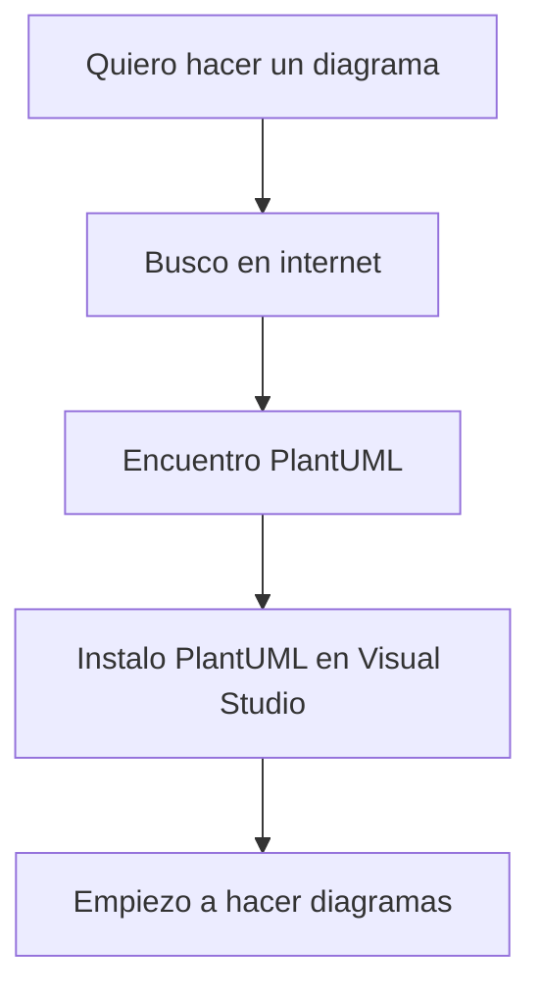
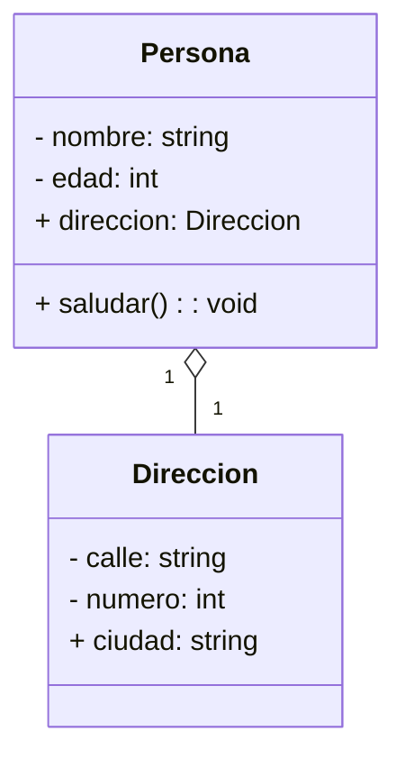

# Qué es UML?

UNIFIED MODELING LANGUAGE. Nos sirve para ayudarnos a:
- Modelar sistemas de forma visual
- Tener un estándar para compartir información con otros compañer@s

UML lo que nos ofrece es una colección de diagramas que nos permiten modelar sistemas de forma visual.

No es una herramienta. Hay decentas (cientos) de herramientas que soportan o permiten trabajar con UML.

UML es un estándar ISO, no una herramienta.
Como estándar os podéis imaginar: ES UN PURO !
Como lenguaje está guay!

Como me obsesione y me quiera convertir en el Cervantes del UML (o en el Shakespeare del UML) voy jodido... es duro!
Si rebajo un poquito mis expectativas y me conformo con ser el Perez-Reverte del UML... pues ya no está tan mal!

OJO! Si mi interlocutor es un ser humano.. No habrá mucho problema. 
El problema es si mi interlocutor es un programa.. Y los programas son muy cuadriculados!

Una ventaja o gracia de usar UML es la capacidad de generar código (el esqueleto de un programa) en automático de los diagramas que hagamos (hay muchas herramientas que lo hacen). Para esto necesito conocer bien el estándar UML.

## Esto se usa mucho? Es nuevo?

Tiene más años que Maricastaña: 1995-97.
Y se usa mucho? CASI NADA !
UML caso en desgracia hace muchos años.

* Y eso? Es malo? NO es malo. Nos ayuda a representar un huevo de conceptos. De hecho extiende conceptos que hemos usado durante décadas, aportando nuevos enfoques.. que luego se han implementado en lenguajes de programación y frameworks.
* Es complejo? No tanto si no me quiero liar... Si me quiero liar (o me obligan a liarme)... un poco
* Es poco práctico? NO. Es super práctico. Nos ayuda a entender y a comunicar conceptos de forma visual.
                    Pone coherencia a los diagramas que hagamos.
* No hay programas que soporten UML? Hay cientos!
* Es un lenguaje.. y es gratis! y muchos programas que lo soportan son gratis!

## Dónde está el problema?
Principalmente en 3 cosas:
1. Cuando surge, la gente (jefes de proyecto) se vuelven LOCOS y quieren que todo se haga en UML y además que el código se genere desde UML.. y es complejo llegar a ese nivel.
2. Los programas que han existido son un COÑAZO ENORME!!! Son como un powerpoint... ahí arrastrando cajas y flechas... y no es práctico. Me llevo horas para hacer un diagrama! Y luego si quiero cambiar algo... me llevo más horas!
3. El código que escribiremos luego, posiblemente implique cambios que no están reflejados en el diagrama... y entonces el diagrama se queda obsoleto: EXISTE MANTENIMIENTO DE DIAGRAMAS!

Depende el uso que le quiera dar: NO ESTA NADA MAL!

Y últimamente está habiendo un resurgir de UML... pero con herramientas más prácticas y modernas.

En la formación vamos a estar usando:
- Mermaid  (más o menos cumple el estándar UML: Hay cosas que si y cosas que no) = SENCILLO
- PlantUML (cumple muy bien el estándar UML)                                     = MÁS COMPLEJO
Ambos son librerías que a su vez nos ofrecen sus propios lenguajes para hacer diagramas, diagramas compatibles con UML.

Pero hay una gracia, ambos 2, esos lenguajes que definen son lenguajes de TEXTO. Y convierten esos textos a diagramas UML (gráficos) en automático. Y nos permiten quitarnos del embrollo de estar arrastrando cajas y flechas.

Y hoy en día hay una gracia mayor... Y es que esos textos ni siquiera los vamos a escribir nosotros. Se los dejaremos a unos expertos en escribir textos.. que casi los escriben mejor que nosotros.. Al menos MUCHÍSIMO MAS RÁPIDO (órdenes de magnitud más rápido): LLM: ChatGPT, Copilot... y otros que irán saliendo.

En nuestro caso, estaremos usando Visual Studio, que es un bloc de notas (ultra enriquecido). A este programa le podemos instalar EXTENSIONES (PLUGINS) Que aumentan su funcionalidad:
- PlantUML
- Mermaid
Ambas 2 integradas con el lenguaje MARKDOWN.

## Tipos de diagramas UML

Los clasificamos en 2 grandes grupos:

- Diagramas estructurales o estáticos
  - Diagramas de clases
  - Diagramas de componentes
  - Diagramas entidad-relación
  - Diagramas de objetos
- Diagramas de comportamiento o dinámicos -> Me ayudan a entender cómo se comporta el sistema... y en definitiva al sistema en sí.
  - Diagramas de casos de uso
  - Diagramas de secuencia
  - Diagramas de colaboración
  - Diagramas de actividades
  - Diagramas de máquinas de estados

---

# MARKDOWN?

Markdown es el *lenguaje* estándar que usamos hoy en día para **documentar software**.

Si quiero referirme a una palabra de un programa (constante, variable, clase, función): `mivariable`

```python
def saludar(nombre):
    print(f'Hola {nombre}')

saludar('Juan')
```





